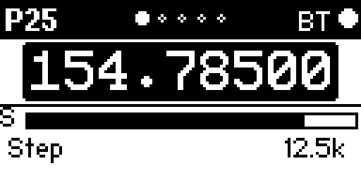
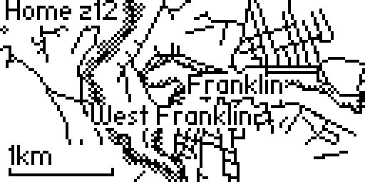

This is LakeShark Flipper Edition, which is basically a control head for the LakeShark SDR receiver on a Waveshare ESP32-P4-NANO. The radio does receiving and decoding and the Flipper acts as a remote control. It supports connections over the GPIO pins and Bluetooth.

## What it do

I've added four receivers and all of them are a work in progress. I will try to rate them below for your expectations. I will continue to refine these and will update this table. 
 - 9/8/2026

| Receivers | Status |
| --- | --- |
| P25 | B- |
| FM | C- |
| POCSAG | C |
| ADS-B | C |

P25 shows talkgroup, NAC, modulation and the decoded voice status, with an S meter that updates every IQ buffer. FM covers narrowband listening, wideband, and *a scan mode that sweeps a range and lets you jump to the strongest signal*(Not working currently). POCSAG keeps a log of received pages, and because pages arrive in bursts there is a full-screen view for reading one and a tape along the bottom showing how many arrived per second. ADS-B lists traffic with altitude, climb or descent and ground speed, opens a single aircraft for detail, and draws a moving map.

| | |
| --- | --- |
|  |  |
|  |  |
|  |  |

The map needs a `map.pmtiles` archive on the SD card. It looks for one at
`apps_data/lakeshark_p25/map.pmtiles` first and falls back to ZeroMesh's copy,
so if you already run ZeroMesh you do not need a second one. Without an
archive the map draws its frame and scale bar and nothing else.

Frequencies can be typed in directly, stepped with the tuning control, or recalled from memories. Each receiver keeps its own memory page, and presets can be loaded from a file on the SD card.

Settings are split into levels, audio, link, device, display, alerts and about. From the device page you can reboot the radio, reset the coprocessor, restart or power cycle the SDR, turn the radio's Bluetooth off, and change its log level without going near a serial cable. The about page reports which firmware the radio is actually running, which matters when it is in another room.

Alerts are on their own page: LED, vibration and a tone, each independent, and a switch per event so a page, a voice call, a capture, new traffic and the link coming up can be told apart or turned off. Tones are read from ZeroMesh's ringtone folder if you have one.

The head alerts you when the receiver drops off or goes silent, and again when it comes back. This is mainly a workaround due to certain ESP32-P4 boards behaving differently with USB connections. Hoping I can get this more reliable in the future.

## Connection

**UART.** Wire the Flipper to the radio's header, then set the link to UART in settings.

## Do not power the ESP32-P4 from the Flipper 5V pin. 
| Flipper | Radio |
| --- | --- |
| Pin 13 (TX) | RX |
| Pin 14 (RX) | TX |
| Pin 11 (GND) | GND |

115200 baud, 8N1.

**Bluetooth.** Set the link to Bluetooth in settings and the radio connects to the head on its own. The radio needs `ble on` once. Pairing is automatic and there is no code to enter.

Full setup notes are in [docs/CONNECTING.md](docs/CONNECTING.md).

## Power

## Do not power the ESP32-P4 from the Flipper 5V pin. 
It will most likely result in nothing working and could result in a broken flipper. Don't hurt the lil-guy.

## Building

The app builds with ufbt.

```
ufbt launch
```

The radio firmware is a separate project and lives in the LakeShark repository.

## Requirements

A Flipper Zero on firmware with API 87.1 or later. An ESP32-P4 board running the LakeShark firmware with an RTL-SDR attached — the NANO and the WIFI6-Touch-LCD-4.3 are the two this has been used against.

Optional, for the ADS-B map: a `map.pmtiles` archive on the SD card, as above.
