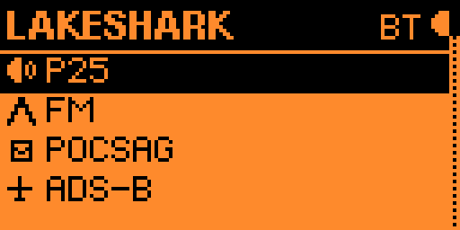
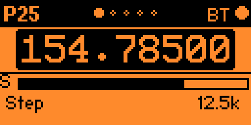
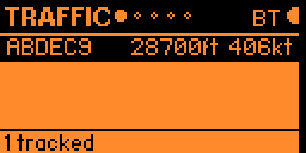
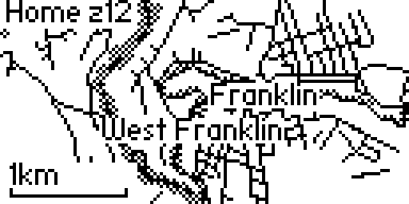
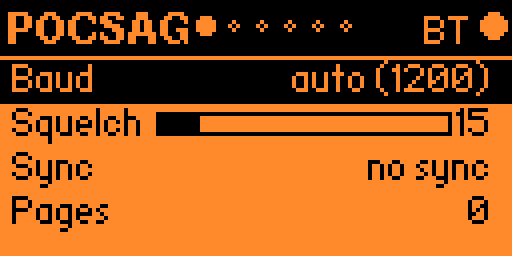
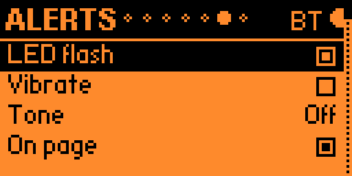
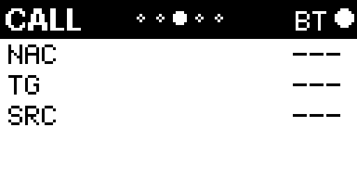
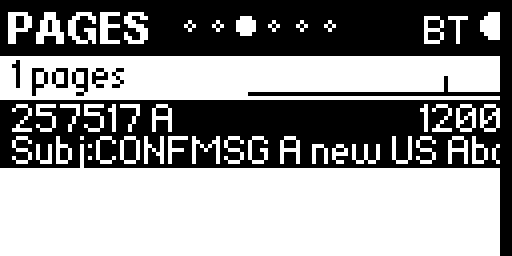

LakeShark Flipper Edition is a control head for the LakeShark SDR receiver. Use Bluetooth with the LilyGO T-Display-P4, or Bluetooth and supported GPIO connections with the headless ESP32-P4 boards. The receiver handles radio reception and decoding; the Flipper controls receiver selection, tuning, volume, alerts and recording transfer.

## Screenshots

| Launcher | P25 |
| --- | --- |
|  |  |
| **ADS-B traffic** | **ADS-B map** |
|  |  |
| **POCSAG** | **Alerts** |
|  |  |
| **P25 call** | **POCSAG pages** |
|  |  |

**[User guide: every page, button controls and setup](docs/wiki/Home.md)**

## What it do

The launcher has four receivers plus a recorder, a file browser and a DF beacon. Most of it works great now. I will keep rating everything below for your expectations and will update this table as I go.
 - 10/5/2026

| App | Status |
| --- | --- |
| P25 | A |
| FM | A- |
| POCSAG | B+ |
| ADS-B | A |
| REC | B+ |
| Files | B+ |
| DF Beacon | B+ |

P25 shows talkgroup, NAC, source ID and the decoded voice status, with an S meter that updates every IQ buffer. The SIGNAL page graphs signal, BCH errors, IQ rate and buffer fill, and the SYSTEM page shows the loaded profile, GPS site following and Phase II follow. On the LR2021 version of the T-Display-P4 the radio decodes P25 voice with no SDR at all.

FM covers narrowband and wideband listening with squelch, EQ presets and a scan mode that sweeps a range and lets you jump to the strongest signal. POCSAG tunes like the others, picks the baud rate on its own and keeps the last 48 pages. ADS-B lists traffic, opens a single aircraft for detail, shows decoder stats, and draws aircraft on an offline map from a `map.pmtiles` file on the SD card.

REC is a remote for the radio's OOK burst recorder. Arm it, catch a burst, and it lands on the Flipper as a SubGHz RAW `.sub` file in `subghz/lakeshark`, ready to replay from the SubGHz app. Files downloads captures that are already saved on the radio.

Frequencies can be typed in directly, stepped with the tuning control, or recalled from memories. Each receiver keeps its own memory page, and presets can be loaded from a file on the SD card.

Settings are split into levels, audio, link, device, display, alerts and about. Levels has a Voice row for the radio's speech. Alerts can flash the LED, vibrate or play a ringtone when a page comes in. From the device page you can reboot the radio, reset the coprocessor, restart or power cycle the SDR, and turn the radio's Bluetooth off.

DF Beacon turns the Flipper into a low-power transmitter for calibrating the radio's COMPASS FIND: set it down a few metres away, start it, and follow the calibration steps on the radio. It sends on 915 MHz at about -10 dBm by default; LEFT and RIGHT pick 433.92 MHz before it starts. It stops after three minutes.

The head alerts you when the receiver drops off or goes silent, and again when it comes back. This is mainly a workaround due to certain ESP32-P4 boards behaving differently with USB connections. Hoping I can get this more reliable in the future.

## Install

Grab `lakeshark_p25-v2.8.fap` from the [latest release](https://github.com/SAMS0N1TE/LakeShark-Flipper/releases/latest) and copy it to `apps/GPIO` on the Flipper's SD card with qFlipper. It shows up as LakeShark SDR.

## Connection

**Bluetooth.** In the Flipper's own settings turn Bluetooth on and Expansion Modules off. Open the app and set the link to Bluetooth in settings. On the T-Display-P4, open LINK on the radio, go to the Bluetooth tab and press SCAN. The headless boards need `ble on` once on their console. Pairing is automatic, there is no code to enter, and the radio reconnects on its own after that.

**UART.** For the headless boards. Wire the Flipper to the radio's header, then set the link to UART in settings.

## Do not power the ESP32-P4 from the Flipper 5V pin. 
| Flipper | Radio |
| --- | --- |
| Pin 13 (TX) | RX |
| Pin 14 (RX) | TX |
| Pin 11 (GND) | GND |

115200 baud, 8N1.

Full setup notes are in [docs/CONNECTING.md](docs/CONNECTING.md).

## Power

## Do not power the ESP32-P4 from the Flipper 5V pin. 
It will most likely result in nothing working and could result in a broken flipper. Don't hurt the lil-guy.

## Building

The app builds with ufbt.

```
ufbt launch
```

The radio firmware is a separate project and lives in the [LakeShark repository](https://github.com/SAMS0N1TE/LakeShark).

## Requirements

A Flipper Zero on firmware with API 87.1 or later.

A LilyGO T-Display-P4 (SX1262 or LR2021 version), or a Waveshare ESP32-P4-NANO or ESP32-P4-WIFI6, running LakeShark 2.8.1 or later. The receivers need an RTL-SDR, except on the LR2021 version, which does P25 voice and ADS-B on its own.
