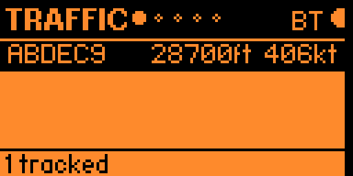
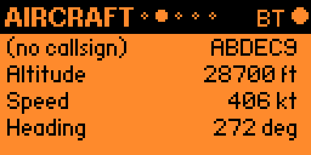
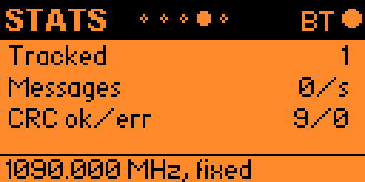
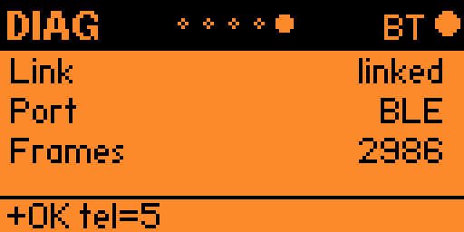

# ADS-B

ADS-B shows aircraft reports received by the LakeShark radio at **1090 MHz**. The Flipper is the control head: it displays the radio's aircraft list, details and decoder statistics, with an optional offline map.

Use **Left/Right** to cycle through **Traffic → Aircraft → Map → Stats → Diag**. **Back** returns to the launcher, except while closing a map toolbar, town list or pan mode. The dots along the header show the current page; `BT` identifies the Bluetooth connection in these screenshots.

## Traffic

Each row shows the callsign, or the six-digit hexadecimal ICAO address when no callsign is available, followed by altitude in feet and speed in knots. A `^` or `v` marks a climb or descent greater than 300 feet per minute. The footer gives the number of aircraft in the list.

- **Up/Down:** select an aircraft; the list scrolls as needed.
- **OK:** open Aircraft details for the selected entry.
- **Left/Right:** change pages.

`No aircraft` means the list is empty. `No link` means the control head has no active link. A populated list does not guarantee that each aircraft has a usable position for the map.

## Aircraft

The details page shows callsign/address, altitude in feet, speed in knots and heading in degrees. In the screenshot, `ABDEC9` has no callsign, an altitude of 28,700 ft, speed of 486 kt and heading of 272 degrees.

**Up/Down** selects another aircraft. Opening this page with **OK from Traffic** preserves the selection. Changing pages with Left/Right resets the list selection.

Climb rate and message count/age are additional fields in the renderer, shown only when screen space permits; they are not visible in this standard Flipper screenshot. There is no separate scroll control for those hidden fields.

## Map and range

The map uses an offline `map.pmtiles` file on the Flipper's SD card. It searches the LakeShark app-data directory first (`/ext/apps_data/lakeshark_p25/map.pmtiles`), then `/ext/apps_data/zeromesh/map.pmtiles`, then the older `/ext/zeromesh/map.pmtiles` location. Without an available map, the page reports `Map unavailable` / `no map.pmtiles`.

Aircraft markers require a valid position from the radio. The lower-left bar is the map scale, such as **1 km** in the screenshot. When the selected aircraft is away from the view center, a distance and compass direction can appear at the lower right. This is distance **from the map's current center**, not a measured receiver-to-aircraft range.

| Control | Action |
|---|---|
| Up | Cycle backward through aircraft with valid positions |
| Down | Open the map toolbar |
| Short OK | Increase zoom; wrap to the map's minimum zoom after its maximum |
| Hold OK | Enter or leave pan mode |
| D-pad in pan mode | Move the map |
| Back in pan mode | Leave pan mode |
| Left/Right outside map controls | Change application page |

`PAN` appears while panning. A short OK still changes zoom in pan mode. Map detail and available zoom levels depend on the installed map file.

Open the toolbar with **Down**, choose an icon with **Left/Right**, and press **OK**. **Back** or **Down** closes it.

| Toolbar item | Action |
|---|---|
| Towns | Open the available town list; Up/Down selects, OK centers the map, Back closes |
| Names | Toggle labels |
| Home | Return to the built-in home coordinate; this is not your live GPS position |
| Node | Cycle forward through aircraft with valid positions |
| Zoom | Cycle the zoom level |
| GPS | Toggle the GPS status overlay; currently displays `SAT:-` because this app does not receive a GPS fix |

## Stats

The standard display shows **Tracked**, **Messages** per second and **CRC ok/err**. The footer confirms the fixed 1090.000 MHz frequency. CRC counts describe accepted and failed decoder checks; they are not the control-head connection's packet counters.

**Hold OK** to request automatic receiver gain. There is no frequency or range adjustment on this page. Preambles, magnitude and last-message age exist as additional statistics but are omitted when they do not fit the screen.

## Diag and testing

Diag shows the connection state, transport and received control-head frame count. The bottom line is the latest command reply. The screenshot shows `linked`, `BLE`, 2,986 frames and the reply `+OK test=5`.

- **Short OK:** send `PING` to the radio.
- **Hold OK:** run the Flipper's local telemetry-parser self-test. This feeds sample P25/ADS-B records into the parser, logs the results, then clears the local telemetry and frame count until live updates arrive again.

The `+OK test=5` footer is a recorded reply, not a Flipper button label. This ADS-B page has no button that starts the radio's ADS-B RF test. Its long-OK parser check does not verify RF reception or transmit a test signal.

[Return to the guide](Home.md)
