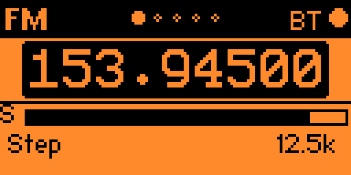
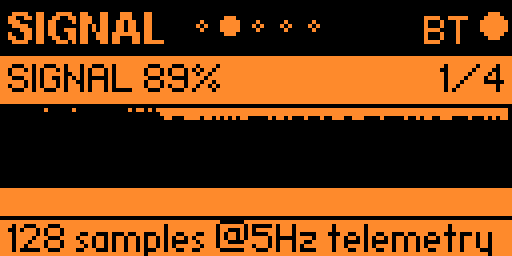
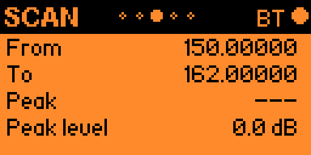
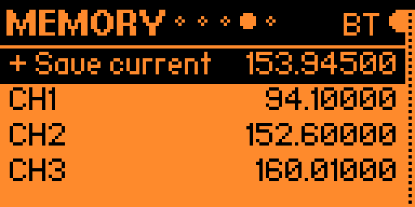
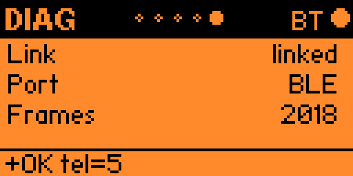

# FM

Select **FM** in the launcher to request LakeShark's **FM listen** mode. The Flipper controls the receiver; tuning and scan results come back over the active link.

Use **Left / Right** to cycle **FM → SIGNAL → SCAN → MEMORY → DIAG**. **Back** returns to the launcher when you are not editing. The header dots show which page is open.

## FM: tune and adjust

The large readout is the tuned frequency in **MHz**: **153.94500 MHz** in this example. The **S** bar is a relative IQ signal indicator, not a calibrated dBm reading. **Step 12.5k** sets a 12.5 kHz tuning increment.

Use **Up / Down** to move through the frequency and the scrolling controls: **Step, Vol, Gain, Sql, Audio, Mute**. Only the first control row is visible in the screenshot.

| Action | Buttons |
|---|---|
| Adjust selected frequency/value | Short **OK** |
| Increase while adjusting | **Up** or **Right** |
| Decrease while adjusting | **Down** or **Left** |
| Leave adjustment mode | Short **OK** or **Back** |
| Enter an exact frequency | Hold **OK** on the frequency |
| Toggle speaker mute | Select **Mute**, then short **OK** |

Adjustments take effect as you make them. In the separate frequency digit editor, **Left / Right** moves between digits, **Up / Down** changes the selected digit, **OK** sends the frequency and **Back** cancels the entry.

- **Step:** choose 1.25k, 3.125k, 5k, 6.25k, 12.5k, 25k, 100k or 1M.
- **Vol:** speaker volume; **M** marks mute.
- **Gain:** receiver gain in dB, independent of volume.
- **Sql:** squelch threshold with **OPEN** or **mute** status. A strong signal can still be silent if the squelch is closed or the speaker is muted.
- **Audio:** flat, voice, punch, full or custom EQ preset.

## SIGNAL: follow incoming telemetry

The example shows **SIGNAL 89%**, trace **1/4**, and **128 samples @5Hz telemetry**. This is a time-history graph, not a frequency spectrum.

Short **OK** cycles **SIGNAL**, **BCH ERR**, **IQ RATE** and **RING**. The latter two show IQ throughput relative to the reference rate and ring-buffer fullness. BCH ERR is a shared P25-oriented diagnostic; it is not an FM audio-quality score.

**Up / Down** tunes by the current step. Hold **OK** clears the local history. If the link is down, the footer reports **no link**; a retained graph should not be mistaken for fresh reception.

## SCAN: restart a sweep or tune its peak

| Field | Meaning |
|---|---|
| From | Receiver-reported start frequency in MHz |
| To | Receiver-reported stop frequency in MHz |
| Peak | Frequency of the reported scan peak; **---** when none is available |
| Peak level | Receiver-reported scan peak level in dB |
| Sweeps | Completed sweep count, when display space permits |

This screenshot shows a **150.00000–162.00000 MHz** range with no peak frequency yet. The displayed **0.0 dB** should not be treated as a detected station when Peak is **---**.

- Short **OK** sends **SCAN** to restart scanning.
- Hold **OK** sends **PEAK** to request tuning to the reported peak.

This page does not edit From/To: its input handler provides restart and peak-tune actions only. Its toast acknowledges the command request; check subsequent frequency/scan telemetry to confirm the receiver's result.

## MEMORY: save stations and recall them

**Up / Down** selects **+ Save current**, a saved channel or a preset. The example contains CH1 at **94.10000 MHz**, CH2 at **152.60000 MHz** and CH3 at **160.01000 MHz**. These are example saved entries, not guaranteed active stations.

| Selected row | Short OK | Hold OK |
|---|---|---|
| + Save current | Save the current frequency | No additional action |
| Saved channel | Tune it | Delete it |
| Preset below PRESETS | Tune it | Copy it into saved memories |

Memories are stored on the Flipper separately for each app, with a 32-entry limit. Duplicate frequencies are rejected. Scroll down to reach entries beyond those shown on screen.

## DIAG: confirm communication

**Link linked** and **Port BLE** identify the active Bluetooth control connection. **Frames 2018** counts received telemetry; it is not a count of FM stations or audio frames. The bottom reply **+OK tel=5** acknowledges the telemetry rate.

Short **OK** sends **PING**; hold **OK** runs the link self-test. More rows appear when screen space permits, including replies/bad frames, IQ rate, ring occupancy and read errors/audio drops.

For silent reception, first check link/frame updates, then the tuned frequency, mute/volume and squelch state. Scan results and a high S bar do not guarantee usable audio.

[P25 guide](P25.md) · [Wiki home](Home.md)

[Return to the guide](Home.md)
