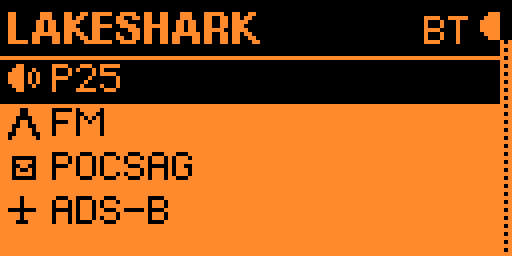
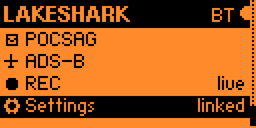

# LakeShark Flipper guide

LakeShark turns the Flipper Zero into a control head for an ESP32-P4 SDR receiver. The radio receives and decodes signals; the Flipper handles tuning, telemetry and controls.

Use **Up/Down** to select an app and **OK** to open it. **Back** from the launcher exits LakeShark. Inside an app, Left/Right usually changes pages; editing and map navigation use these buttons differently, as described in each guide.

## Start here

- [Getting started](Getting-Started.md): installation, Bluetooth and UART setup.
- [P25](P25.md): tuning, calls, signal, memories and diagnostics.
- [FM](FM.md): tuning, signal, scanning and memories.
- [POCSAG](POCSAG.md): pager tuning and received messages.
- [ADS-B](ADS-B.md): traffic, aircraft details, offline map and statistics.
- [Recording](Recording.md): pulse captures, downloading and opening files in SubGHz.
- [Settings](Settings.md): levels, audio, connection, device, display and alerts.

Screenshots were captured on September 8, 2026. Their readings and firmware labels are examples, not defaults. This guide covers the Flipper interface; map storage and controls on the LCD and T-Display are different.
