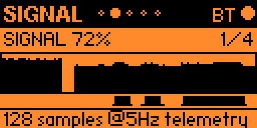
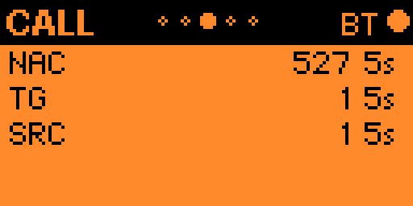
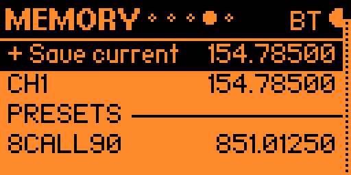
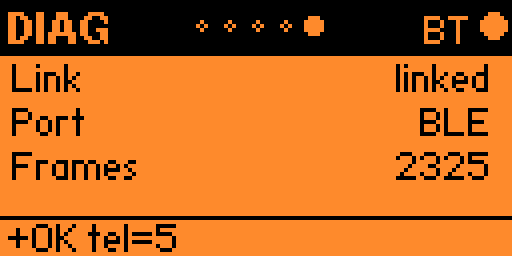

# P25

The Flipper is the control head: it sends tuning and receiver commands to LakeShark and displays returned telemetry. Select **P25** in the launcher to request P25 mode.

Use **Left / Right** to cycle through **P25 → SIGNAL → CALL → MEMORY → DIAG**. The dots in the header mark the page. **Back** returns to the launcher, except while editing a value. The supplied screenshots show the Bluetooth transport; use DIAG to check the actual link.

## P25: tune and adjust

The large number is the tuned frequency in **MHz**: this example is **154.78500 MHz**. The **S** bar is a relative indicator derived from receiver IQ level, not a calibrated dBm measurement. **Step 12.5k** means each tuning increment is 12.5 kHz.

The short display shows only part of the control list. Use **Up / Down** to select the frequency or scroll through **Step, Vol, Gain, Vgate, Audio, Mute**.

| Action | Buttons |
|---|---|
| Start adjusting the selected frequency/value | Short **OK** |
| Increase while adjusting | **Up** or **Right** |
| Decrease while adjusting | **Down** or **Left** |
| Leave adjustment mode | Short **OK** or **Back** |
| Open digit-by-digit frequency entry | Hold **OK** on the frequency |
| Toggle mute | Select **Mute**, then short **OK** |

Ordinary adjustments send changes as you make them; leaving adjustment mode is not an undo operation. In the separate digit editor, **Left / Right** selects a digit, **Up / Down** changes it, **OK** sends the frequency, and **Back** cancels that entry.

- **Step:** 1.25k, 3.125k, 5k, 6.25k, 12.5k, 25k, 100k or 1M.
- **Vol:** speaker volume; an **M** indicates mute.
- **Gain:** receiver gain, displayed in dB. It is separate from speaker volume.
- **Vgate:** P25 voice-gate setting.
- **Audio:** selects flat, voice, punch, full or custom EQ preset.

## SIGNAL: watch reception over time

This example shows **SIGNAL 72%**, trace **1/4**, with **128 samples @5Hz telemetry**. The graph is a history of incoming telemetry, not an RF spectrum or waterfall.

Short **OK** cycles four traces:

| Trace | Meaning |
|---|---|
| SIGNAL | Relative IQ signal level |
| BCH ERR | Percentage of BCH checks that failed between telemetry updates |
| IQ RATE | Incoming IQ byte rate as a percentage of the reference rate |
| RING | Receiver ring-buffer fullness |

The small activity marks beneath the graph distinguish synchronization from active voice. **Up / Down** tunes up/down by the current step from this page. Hold **OK** to clear the local graph history.

A high signal percentage alone does not establish successful P25 decoding. Check CALL for decoded identifiers and their ages.

## CALL: identify received traffic

- **NAC:** Network Access Code, shown in hexadecimal; the example is **527**.
- **TG:** talkgroup ID, shown in decimal.
- **SRC:** source radio ID, shown in decimal.
- The suffix such as **5s** is the age of the last received value. It is not a call duration. Old identifiers may remain visible after traffic stops; **---** indicates no available value.

The supplied landscape view fits the first three fields. The renderer also has BCH counts, demodulation/polarity, frame type and sync/voice counters, displayed only when the screen has room.

Short **OK** requests the next demodulator. **Up** or **Down** toggles polarity. Hold **OK** sends **RESET** to the receiver; the head labels this action “Stats reset.” These are receiver commands, not local changes to how the screenshot is drawn.

## MEMORY: save and recall frequencies

**Up / Down** selects a row. The selection skips the PRESETS divider.

| Selected row | Short OK | Hold OK |
|---|---|---|
| + Save current | Save the current frequency on the Flipper | No additional action |
| Saved channel, such as CH1 | Tune that frequency | Delete that saved channel |
| Preset, such as 8CALL90 | Tune that frequency | Copy the preset into saved memories |

P25 has its own memory list, with up to 32 saved entries. Duplicate frequencies are rejected. The screenshot's **8CALL90 851.01250** is a preset frequency entry; it does not establish that a nearby system is transmitting P25 there.

## DIAG: check the control link

The example reports **Link linked**, **Port BLE**, and **Frames 2325**. Frames counts received telemetry, not decoded P25 voice frames. The bottom line shows the latest reply; **+OK tel=5** is a telemetry-rate acknowledgment.

- Short **OK** sends **PING**.
- Hold **OK** starts the link self-test.
- Additional diagnostic rows appear only when there is display room: replies/bad frames, IQ rate, ring occupancy, read errors/audio drops and decode time.

If commands appear ineffective, check that the link is linked and the frame count advances. A linked control head does not by itself prove that the radio has signal or decoded voice.

[FM guide](FM.md) · [Wiki home](Home.md)

[Return to the guide](Home.md)
