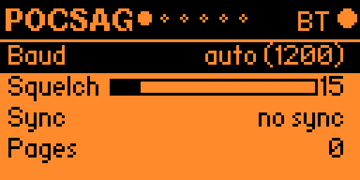
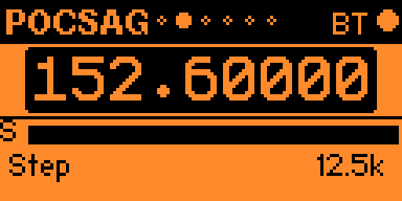
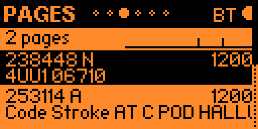
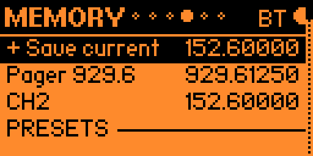
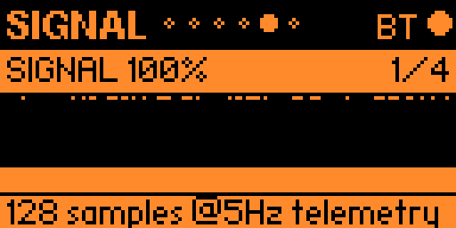
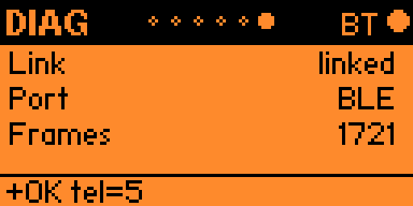

# POCSAG

POCSAG receives decoded pager messages from LakeShark. The Flipper is the control
and message display: its Pages list contains decoded address/text metadata,
**not an IQ recording or an audio recording**.

Use **Left/Right** to move through POCSAG → frequency view → Pages → Memory →
Signal → Diag. **Back** returns to the launcher; from message detail, it first
returns to the list.

## Set reception options

*The screenshot shows automatic baud selection reporting 1200, squelch 15,
no sync, and zero decoded pages at that moment.*

- **OK** switches selection between Baud and Squelch.
- **Up/Down** adjusts the selected setting.
- Baud choices are **auto, 512, 1200, and 2400**. The list stops at either end.
- **Sync** reports `LOCKED` or `no sync`; a baud number by itself does not mean
  a valid pager transmission is being decoded.
- **Pages** is the board's decoded-page counter.

## Tune a frequency

*The frequency view is tuned to 152.60000 MHz with a 12.5 kHz step. The S bar is
signal telemetry, not a decoded-message indicator.*

Use **Up/Down** to select a row, then **OK** to edit a value. While editing,
**Up/Right** increases and **Down/Left** decreases; **OK or Back** ends adjustment.
**Hold OK on frequency** opens direct frequency entry. Left/Right changes pages
only when you are not adjusting a value.

## Read messages

*Pages shows two received messages, with the selected row inverted. Each entry
shows an address/type, baud rate, and a text preview. The small activity strip
summarizes recent arrivals.*

| Control | Action |
|---|---|
| Up/Down | Select the previous/next message |
| OK | Open the selected message's detail view |
| Up/Down in detail | Move directly between messages |
| Back in detail | Return to the list |
| Hold OK | Clear the local message list |

Detail shows the address/type, baud, message age, and wrapped text. The current
implementation has no separate text-scroll action inside that view.

The Flipper retains **up to 48 recent messages in memory**. Older entries fall
out of the list. Consecutive identical address/text updates are suppressed, so
the list and activity count are not a lossless pager archive. Clearing the list
does not reset the board's decoder counter; the activity total can therefore
remain nonzero after clearing.

## Save frequencies

*Memory shows “+ Save current,” user memories, and a Presets divider. The names
and frequencies pictured are saved entries, not recommended local channels.*

**Up/Down** selects a row. **OK** saves the current frequency or tunes the selected
memory/preset. **Hold OK** deletes a user memory or copies a preset into the user
list. Saving a frequency does not save the decoded messages.

## Check signal and connection

*Signal shows a 128-sample history at 5 Hz telemetry. `1/4` identifies the first
of four graph choices; it is not a pager timeslot or reception-quality rating.*

**OK** cycles Signal, BCH ERR, IQ RATE, and RING histories. **Hold OK** clears
history. **Up/Down** tunes by the selected step. These are shared telemetry plots;
a high signal level or populated graph is not proof that a POCSAG page decoded.

*Diag reports a linked BLE connection and 121 received link frames. The footer
shows the latest reply. Link frames are distinct from pager messages.*

**OK** sends a ping; **hold OK** runs a link self-test. A connected link with
`no sync` points to a different question than a disconnected control head: check
the tuned channel, baud selection, and incoming signal before treating missing
pages as a transfer problem.

The supplied screenshots demonstrate the listed UI states, including decoded
message previews. They do not establish lossless reception during a message flood
or persistent message export. The LCD v1.0.4 recording download/replay confirmation
belongs to [Recording](Recording.md), not to POCSAG reception performance.

[Return to the guide](Home.md)
