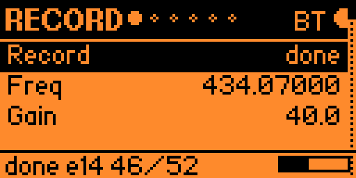
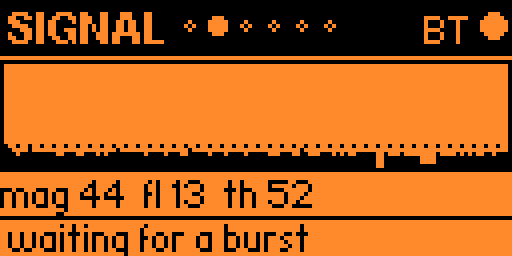
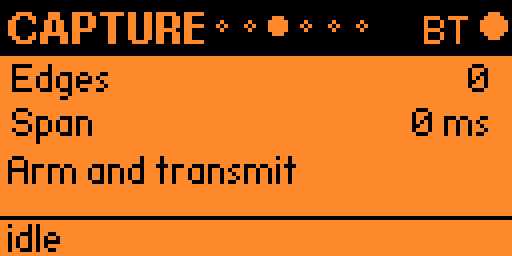
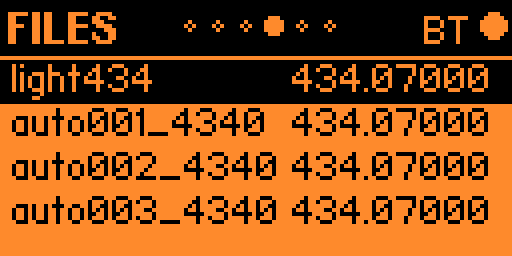
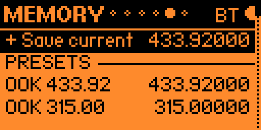
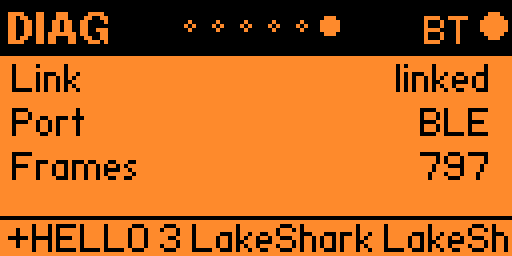

# Recording

Record captures short radio bursts on the LakeShark board and downloads their
pulse timings to the Flipper as a Sub-GHz `.sub` file. It is intended for OOK
burst captures. This export is **not recorded IQ, demodulated audio, or a decoded
protocol message**: the file contains signed RAW pulse durations and an OOK preset.

Use **Left/Right** to move through Record → Signal → Capture → Files → Memory →
Diag. **Back** returns to the launcher, except while editing a value or handling
a transfer dialog.

## Capture a burst

*Record settings at 434.07000 MHz. The bottom line reports `done`, 14 edges, and
signal magnitude/threshold 46/52. These are the screenshot's values, not defaults.*

1. Select **Freq** with Up/Down. Press OK to edit; Up/Right increases and
   Down/Left decreases. OK or Back ends adjustment. Hold OK on Freq for direct entry.
2. Set **Gain** if needed. Hold OK on Gain to request automatic gain.
3. Select **Record** and press OK to arm. Generate the burst you want to capture.
   Pressing OK again while armed or capturing stops recording.
4. Wait for **done**, then open **Capture** and press OK to download to the Flipper.

Scroll the Record settings with Up/Down to reach the remaining controls:

| Field | Meaning |
|---|---|
| Record | Idle, armed, capturing, or done |
| Freq | Receiver frequency in MHz |
| Gain | Receiver gain; `auto` requests automatic gain |
| Thresh | Burst detection threshold; hold OK to restore automatic threshold |
| Gap | Quiet interval that ends a capture, in milliseconds |
| Bandwidth | Capture bandwidth in kHz; hold OK restores automatic selection |
| Min pulse | Minimum pulse duration, in microseconds |
| Max span | Capture duration limit, in milliseconds |
| Min edges | Minimum edge count for a capture |

For value rows, OK enters adjustment, the direction keys change the value, and
OK/Back ends adjustment. Selecting a row by itself does not change it.

## Signal and capture preview

*The Signal page shows magnitude history and a dotted threshold line. `mag` is
current magnitude, `fl` is the estimated floor, and `th` is the threshold.*

On Signal, **Up/Down** tunes by the configured step, **OK** arms/stops recording,
and **hold OK** clears the local trace. A strong trace alone does not prove a
usable capture.

*This Capture screenshot is idle with zero edges and zero span. “Arm and transmit”
means to generate an incoming burst; it does not make the LakeShark board transmit.*

**Edges** is the pulse-duration entry count; **Span** is the capture duration in
milliseconds. Once a capture is ready, **OK** downloads it and saves a `.sub`.
**Hold OK** clears the Flipper's preview, not the board's saved file list.

## Download a saved capture

*Files lists board-side captures by name and frequency. This screenshot selects
`light434`; it is not a list of files already downloaded to the Flipper.*

1. On an empty Files list, press **OK** to request the board's saved captures.
2. Select a capture with **Up/Down**, then press **OK**. This loads the selected
   board file and starts downloading it after its load acknowledgement arrives.
3. Wait for **SAVED**. Files are written to `/ext/subghz/lakeshark/` on the Flipper.
4. Dismiss the dialog, return to **Files**, and **hold OK** to leave LakeShark and
   open the most recently saved capture in the Flipper's Sub-GHz app.

The current SAVED dialog says “OK: open in SubGHz,” but its input handler only
dismisses the dialog. **Hold OK on Files is the implemented launch shortcut.**
It opens the latest file saved by this app session, not necessarily the currently
highlighted board entry.

During a download, **OK or Back cancels the transfer dialog**. Wait for completion
before pressing either. `No radio`, `Load failed`, `Capture size changed`, and
`Capture data changed` indicate that a complete download was not accepted.

## Memory and link checks

*Memory contains saved frequencies and presets. These entries do not contain
recorded bursts.*

Use **Up/Down** to select. **OK** on “+ Save current” saves the current frequency;
OK on a memory or preset tunes it. **Hold OK** deletes a saved memory or copies a
preset into your memories, depending on the selected row.

*Diag shows a linked BLE connection and 737 received link frames. The footer is
the latest command reply; it is not a capture-completion indicator.*

**OK** sends a ping. **Hold OK** runs the link self-test, which is not an RF capture
or replay test.

## Verification status

The user confirmed recording download and replay with the **LCD-4.3 running
v1.0.4**. That confirmation applies to the tested capture and board; it does not
establish T-Display transport support or guarantee that every signal can be replayed.
The screenshots illustrate the supplied UI version and include both completed
and empty capture states; they are not a single uninterrupted capture session.

[Return to the guide](Home.md)
