# Settings

Open **Settings** from the launcher. **Left / Right** cycle through Levels, Audio, Link, Device, Display, Alerts, and About. **Up / Down** select a row and scroll longer pages.

For a value, press **OK**, adjust with **Left / Right**, then press **OK** or **Back** to leave editing. Changes take effect as you adjust; Back does not undo them. Outside editing, **Back** returns to the launcher. Action rows and checkboxes respond directly to **OK**.

## Levels

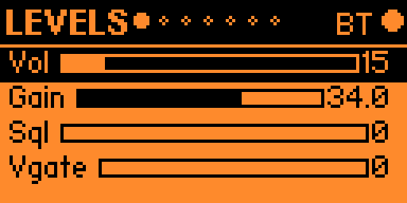

| Control | Purpose |
|---|---|
| Vol | Radio output volume, 0–100 in steps of 5. |
| Gain | RTL-SDR tuner gain, using the tuner's supported gain steps. |
| Sql | Squelch threshold. |
| Vgate | Voice gate threshold. |

Hold **OK** on this page, while not editing, to toggle mute.

## Audio

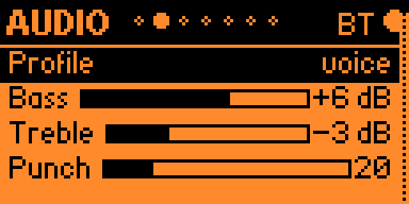

Choose a **Profile**: flat, voice, punch, full, or custom. Adjust **Bass**, **Treble**, **Punch**, **Rumble cut**, and **Loudness** to suit the radio's speaker. Editing an individual sound setting switches the profile to custom.

**Limiter** shows the current gain reduction in dB; it is a readout, not an adjustable setting.

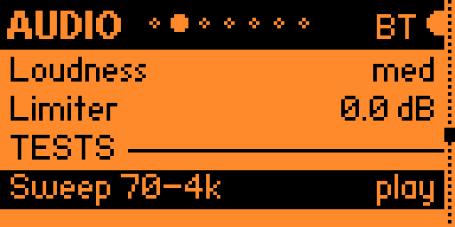

Scroll down to **TESTS**. Select a test and press **OK** to play it through the radio: Sweep 70–4k, Bass ladder, Noise, 1kHz tone, P25 chirp, or Moto alert.

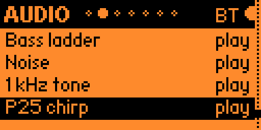

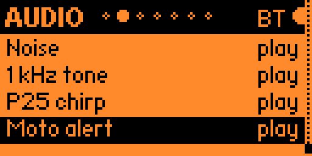

## Link

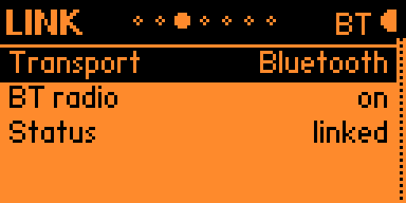

| Row | What it does |
|---|---|
| Transport | **OK** switches between Bluetooth and UART. |
| BT radio | Shows the Flipper's Bluetooth state. Enable Bluetooth through the Flipper's system Settings if it is off. |
| Status | Shows connection state. **linked** means radio telemetry is arriving. **OK** sends a PING. |
| Rate | Telemetry update rate, adjustable from 1 to 20 Hz. |
| Send PING | Sends a link check to the radio. |

With Bluetooth selected, the Flipper advertises and the radio connects to it. If the page says it is advertising, enable the radio's BLE connection with `ble on` from its console. A Bluetooth connection waiting for data has not yet reached **linked** status.

## Device

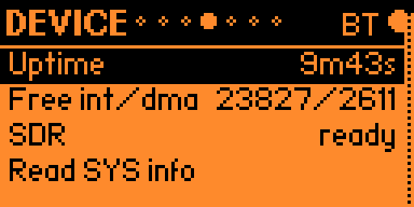

**Uptime**, **Free int/dma**, and **SDR** are live radio readouts. Free int/dma reports available internal and DMA-capable memory in bytes. SDR reports ready, down, or stalled. Select **Read SYS info** and press **OK** to request system information.

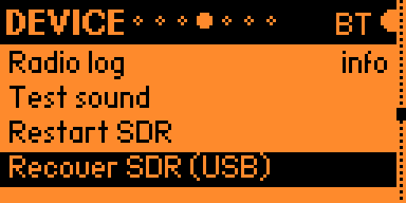

| Action | Result |
|---|---|
| Radio log | Cycles error, warn, info, debug, and verbose on each **OK** press. |
| Test sound | Requests a beep from the radio. |
| Restart SDR | Requests a restart of the SDR stream. |
| Recover SDR (USB) | Requests reopening the SDR's USB connection. |
| Power-cycle SDR | Requests SDR power cycling and a radio reboot. |
| Reset ESP32-C6 | Resets the coprocessor; the BLE connection drops. |
| C6 handshake | Requests the coprocessor handshake. |
| Radio BLE off | Turns off the radio's BLE connection. |
| Reboot radio | Restarts the radio. |

These actions run immediately when you press **OK**. Hardware recovery actions depend on the connected board's firmware and wiring.

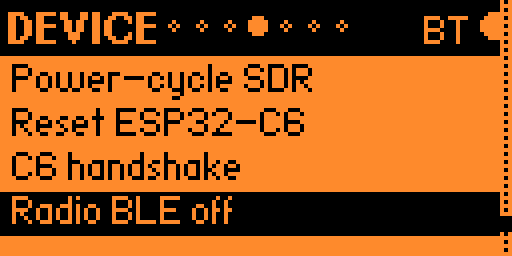

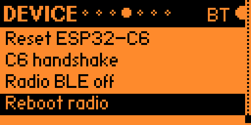

## Display

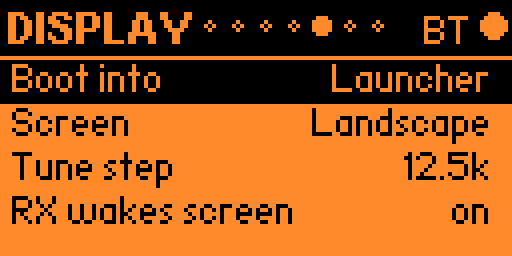

| Setting | Options or behavior |
|---|---|
| Boot into | Open the launcher or a chosen receiver app at startup. Receiver startup waits for the link. |
| Screen | Landscape, Portrait L, or Portrait R for the **Flipper interface**. |
| Tune step | Frequency increment used when tuning. |
| RX wakes screen | Turn on the Flipper backlight and briefly flash the screen when received voice starts. |

## Alerts

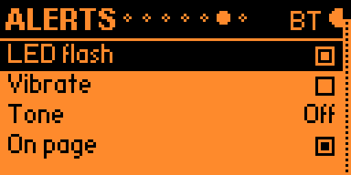

Press **OK** to toggle **LED flash**, **Vibrate**, or an event checkbox. Select **Tone**, press **OK**, and use **Left / Right** to choose a sound or Off.

Event choices are **On page** for pager messages, **On voice**, **On aircraft**, **On capture**, and **On link up**. **Test alert** plays the configured notification so you can check it without waiting for an event.

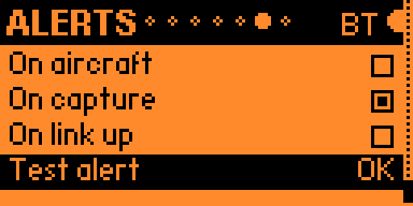

## About

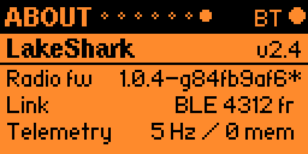

This page identifies the Flipper app and connected radio firmware. **Link** shows the transport and received frame count. **Telemetry** shows the selected update rate and loaded memory count. An asterisk after the radio version identifies a build made with local source changes.

The screenshots show one captured session; version numbers, signal levels, and other live values will differ on your device.

[Back to Home](Home.md)

[Return to the guide](Home.md)
